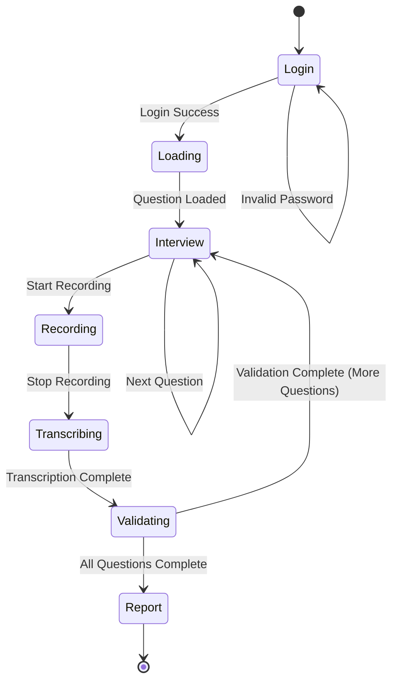
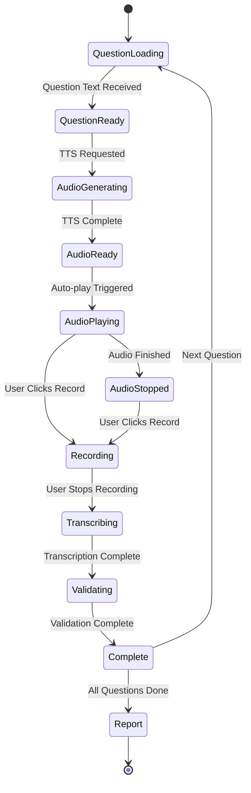
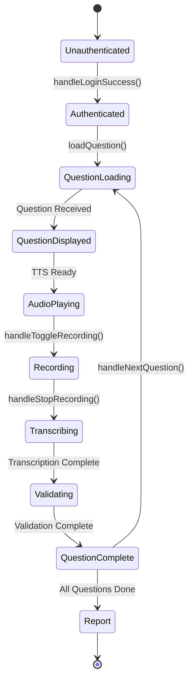
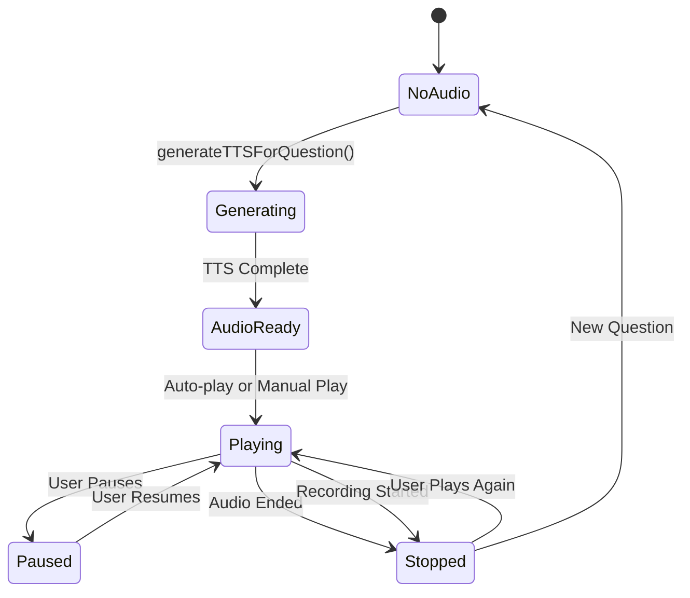
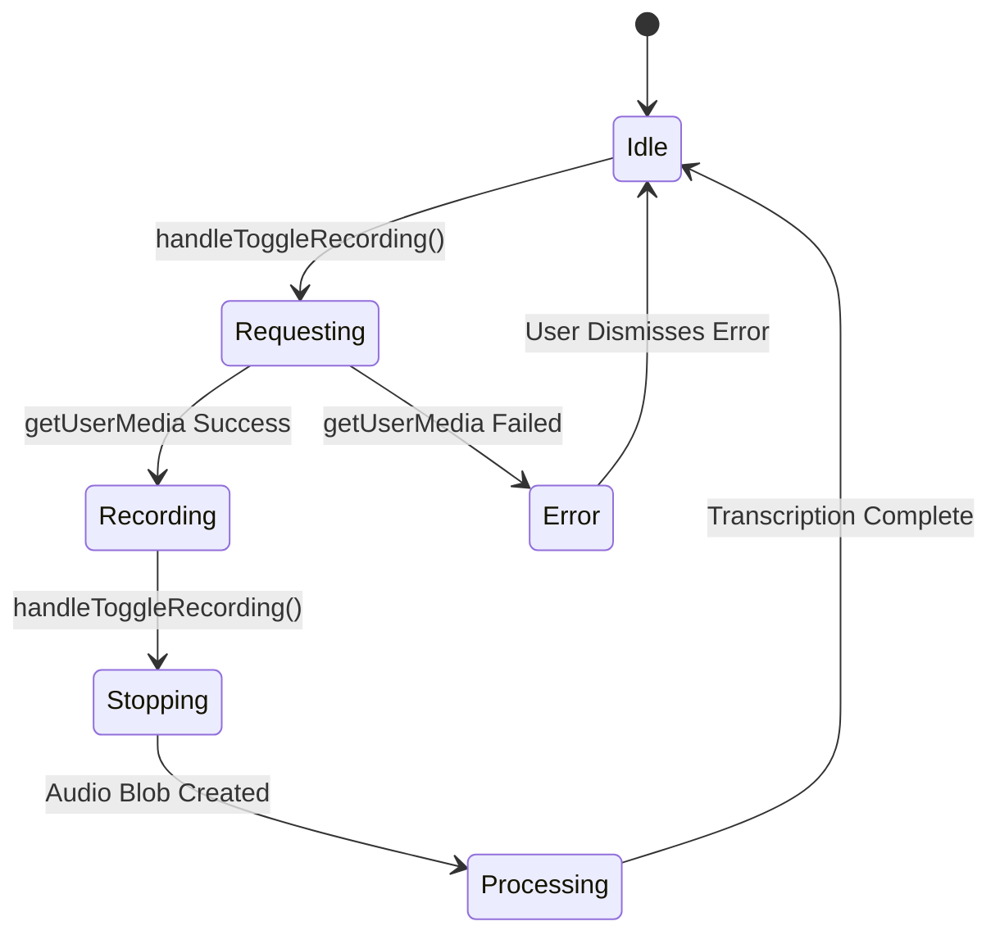
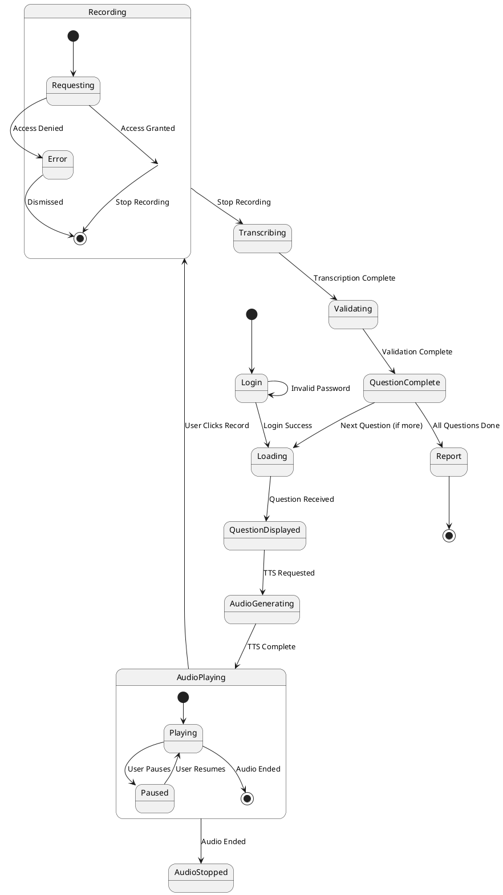

# State Transition Diagrams

## Application State Machine



## Detailed Interview State Machine



## Component State Transitions

### App Component States



### Audio Playback States



### Recording States



## State Variables Reference

### App.js State Variables

```javascript
// Authentication
isAuthenticated: boolean
username: string
subject: string
totalMcqs: number

// Interview Progress
currentQuestionNum: number
interviewResults: Array<InterviewResult>
askedQuestions: Array<{question: string}>
showReport: boolean
showAdminLog: boolean
interviewStartTime: Date

// Question State
question: {
  question: string,
  options: {A, B, C, D},
  correctAnswer: string,
  explanation: string,
  readableText: string,
  audioData: string | null
}
loading: boolean
isLoadingNext: boolean
error: string | null

// Recording State
isRecording: boolean
mediaRecorderRef: MediaRecorder | null
audioChunksRef: Array<Blob>
isRecordingRef: boolean (ref)

// Transcription State
transcribedText: string
isTranscribing: boolean

// Validation State
validationResult: {
  isCorrect: number,
  feedback: string,
  audioData: string
} | null
isValidating: boolean

// Audio State
isAudioPlaying: boolean
hasAudioPlayed: boolean
isGeneratingAudio: boolean
audioRef: HTMLAudioElement (ref)
feedbackAudioRef: HTMLAudioElement (ref)

// Latency Tracking
currentQuestionLatencies: {
  questionNumber: number,
  llmQuestionGeneration: number,
  ttsQuestionGeneration: number,
  sttUserAnswer: number,
  llmAnswerValidation: number,
  ttsAnswerValidation: number
} | null
```

## State Transition Table

| Current State | Event | Next State | Actions |
|--------------|-------|------------|---------|
| Login | Login Success | Loading | setUsername, setSubject, setTotalMcqs, loadQuestion |
| Loading | Question Received | QuestionDisplayed | setQuestion, generateTTSForQuestion |
| QuestionDisplayed | TTS Ready | AudioPlaying | setQuestion.audioData, auto-play |
| AudioPlaying | User Clicks Record | Recording | stopAudio, setIsRecording(true) |
| AudioPlaying | Audio Ended | AudioStopped | setIsAudioPlaying(false) |
| Recording | User Stops Recording | Transcribing | stopRecording, transcribeAudio |
| Transcribing | Transcription Complete | Validating | setTranscribedText, validateAnswer |
| Validating | Validation Complete | QuestionComplete | setValidationResult, playFeedback |
| QuestionComplete | Next Question Clicked | Loading | incrementQuestionNum, loadQuestion |
| QuestionComplete | All Questions Done | Report | setShowReport(true) |

## State Flow Diagram (Text-based)

```
┌─────────────────────────────────────────────────────────────┐
│                    APPLICATION FLOW                         │
└─────────────────────────────────────────────────────────────┘

1. INITIAL STATE: Login Screen
   ├─ State: { isAuthenticated: false }
   └─ User Action: Enter credentials and login
      │
      ↓
2. AUTHENTICATION: Validate credentials
   ├─ State: { isAuthenticated: false, loading: true }
   └─ If valid:
      │
      ↓
3. INTERVIEW INITIALIZATION
   ├─ State: { 
   │    isAuthenticated: true,
   │    currentQuestionNum: 1,
   │    loading: true
   │  }
   └─ Action: loadQuestion()
      │
      ↓
4. QUESTION GENERATION
   ├─ State: { loading: true, question: null }
   └─ API Call: POST /api/interview/start
      │
      ↓
5. QUESTION DISPLAYED
   ├─ State: { 
   │    loading: false,
   │    question: { text, options, ... },
   │    question.audioData: null
   │  }
   └─ Action: generateTTSForQuestion()
      │
      ↓
6. TTS GENERATION
   ├─ State: { isGeneratingAudio: true }
   └─ API Call: POST /api/audio/text-to-speech
      │
      ↓
7. AUDIO READY
   ├─ State: { 
   │    isGeneratingAudio: false,
   │    question.audioData: "base64...",
   │    hasAudioPlayed: false
   │  }
   └─ Action: Auto-play audio
      │
      ↓
8. AUDIO PLAYING
   ├─ State: { isAudioPlaying: true, hasAudioPlayed: true }
   └─ User Action: Click "Start Recording"
      │
      ↓
9. RECORDING STARTED
   ├─ State: { 
   │    isRecording: true,
   │    isRecordingRef.current: true,
   │    isAudioPlaying: false
   │  }
   └─ Action: Stop audio, start MediaRecorder
      │
      ↓
10. RECORDING STOPPED
    ├─ State: { isRecording: false, isTranscribing: true }
    └─ Action: Stop MediaRecorder, transcribeAudio()
       │
       ↓
11. TRANSCRIPTION COMPLETE
    ├─ State: { 
    │     isTranscribing: false,
    │     transcribedText: "user's answer"
    │   }
    └─ Action: Auto-trigger validateAnswer()
       │
       ↓
12. VALIDATION IN PROGRESS
    ├─ State: { isValidating: true }
    └─ API Call: POST /api/interview/validate-answer
       │
       ↓
13. VALIDATION COMPLETE
    ├─ State: { 
    │     isValidating: false,
    │     validationResult: { isCorrect, feedback, audioData }
    │   }
    └─ Action: Display feedback, play feedback audio
       │
       ↓
14. QUESTION COMPLETE
    ├─ State: { 
    │     Next Question: enabled,
    │     Play Once More: disabled,
    │     Start Recording: disabled
    │   }
    └─ User Action: Click "Next Question"
       │
       ↓
15. NEXT QUESTION (Repeat from step 4)
    OR
    ALL QUESTIONS DONE
    ├─ State: { showReport: true }
    └─ Display: Report Screen
```

## State Dependencies

### State Dependencies Graph

```
isAuthenticated
  └─> Determines: Login Screen vs Interview Screen

currentQuestionNum
  └─> Determines: Question progress, Report trigger

question
  ├─> Determines: Question display, TTS generation
  └─> question.audioData
      └─> Determines: Audio playback availability

isRecording
  ├─> Blocks: Audio playback
  ├─> Enables: Recording UI
  └─> isRecordingRef.current (synchronous check)

transcribedText
  └─> Triggers: Auto-validation

validationResult
  ├─> Enables: Next Question button
  └─> Disables: Play Once More, Start Recording

isAudioPlaying
  └─> Determines: Audio playback UI state

hasAudioPlayed
  └─> Prevents: Auto-play after manual stop
```

## State Reset Points

### When New Question Loads

```javascript
// All these states are reset:
setTranscribedText('')
setValidationResult(null)
setError(null)
setIsAudioPlaying(false)
setHasAudioPlayed(false)
setIsRecording(false)
isRecordingRef.current = false
setIsGeneratingAudio(false)
```

### When Recording Starts

```javascript
// Audio is stopped:
audioRef.current.pause()
audioRef.current.currentTime = 0
setIsAudioPlaying(false)
isRecordingRef.current = true
setIsRecording(true)
```

### When Question Completes

```javascript
// Buttons are updated:
// - Next Question: enabled
// - Play Once More: disabled
// - Start Recording: disabled
```

## UML State Diagram (PlantUML Format)



## React State Management Pattern

### State Updates Flow

```
User Action
  ↓
Event Handler
  ↓
State Update (useState)
  ↓
Component Re-render
  ↓
useEffect Hooks Trigger
  ↓
Side Effects Execute
  ↓
UI Updates
```

### Critical State Synchronization

1. **isRecordingRef vs isRecording:**
   - `isRecordingRef.current` is set synchronously
   - `isRecording` state is updated asynchronously
   - Both checked in audio playback logic

2. **question.audioData Updates:**
   - Triggers useEffect for audio setup
   - Must reset `hasAudioPlayed` for new questions
   - Auto-play logic depends on multiple states

3. **Recording State:**
   - Must stop audio immediately when recording starts
   - Ref is used to avoid stale closure issues
   - Reset when new question loads

