# System Diagrams

## Complete System Architecture

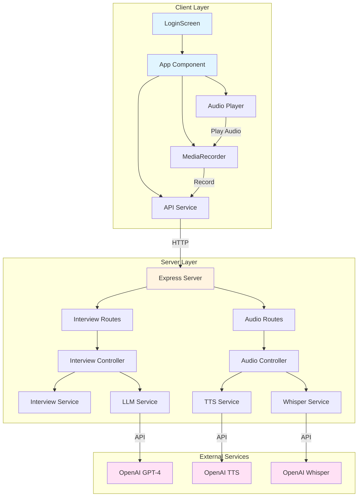

## Data Flow Diagram

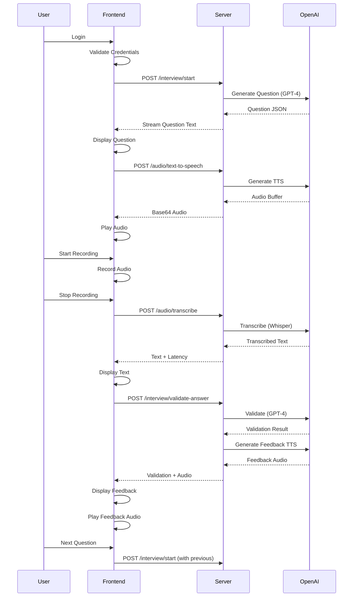

## Component Interaction Diagram

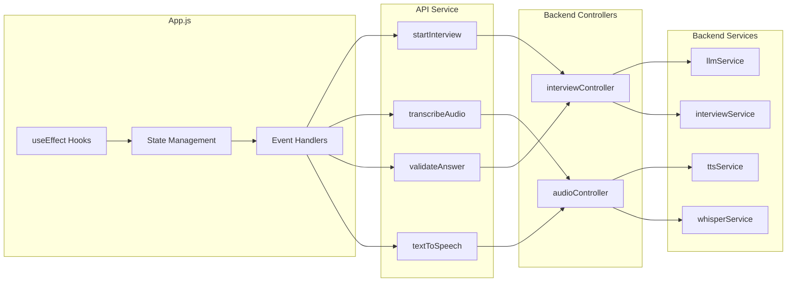

## Interview Flow Diagram

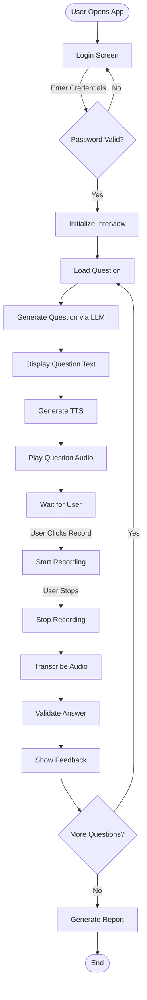

## State Machine - Complete Flow

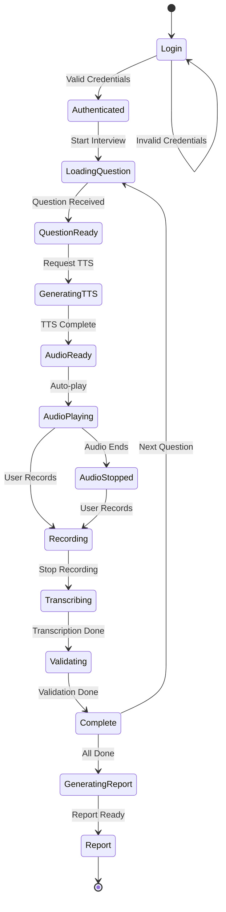

## Audio Processing Pipeline

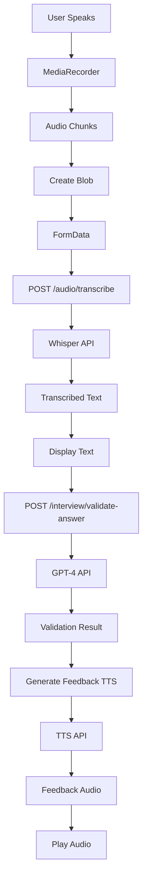

## Question Generation Pipeline

```mermaid
graph LR
    A[User Login] --> B[Select Subject]
    B --> C[POST /interview/start]
    C --> D[Get Previous Questions]
    D --> E[Build Prompt]
    E --> F[GPT-4 API]
    F --> G[Parse Response]
    G --> H[Stream Question]
    H --> I[Display Question]
    I --> J[Request TTS]
    J --> K[TTS API]
    K --> L[Play Audio]
```

## Latency Tracking Flow

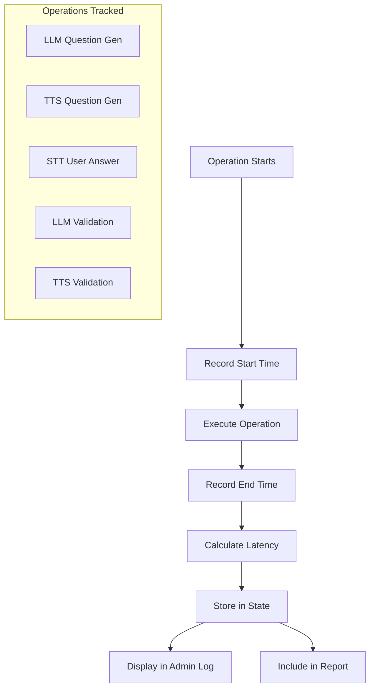

## Error Handling Flow

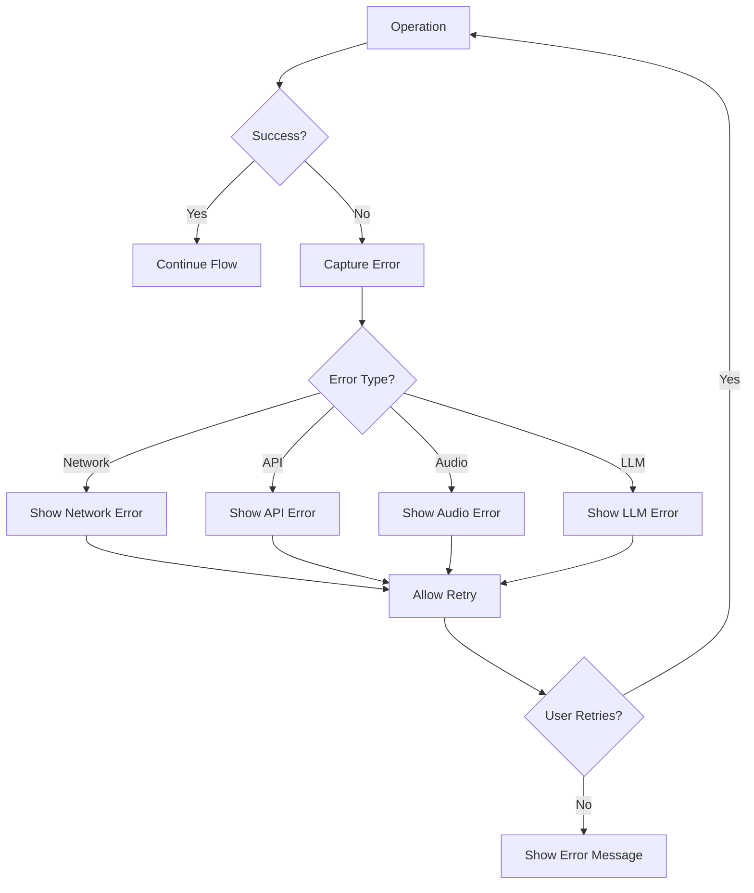

## File Structure Diagram

```
AI-interview/
│
├── client/
│   ├── src/
│   │   ├── components/
│   │   │   └── LoginScreen.js
│   │   ├── services/
│   │   │   └── api.js
│   │   ├── data/
│   │   │   └── mockupData.js
│   │   ├── App.js
│   │   └── App.css
│   └── public/
│
├── server/
│   ├── controllers/
│   │   ├── interviewController.js
│   │   └── audioController.js
│   ├── services/
│   │   ├── llmService.js
│   │   ├── ttsService.js
│   │   ├── whisperService.js
│   │   ├── interviewService.js
│   │   ├── prompts.js
│   │   └── openaiService.js
│   ├── routes/
│   │   ├── interview.js
│   │   └── audio.js
│   ├── middleware/
│   │   └── upload.js
│   └── index.js
│
└── docs/
    ├── API_DOCUMENTATION.md
    ├── WORKFLOW_DOCUMENTATION.md
    ├── STATE_TRANSITION_DIAGRAMS.md
    ├── ARCHITECTURE.md
    └── SYSTEM_DIAGRAMS.md
```

## Technology Stack Diagram

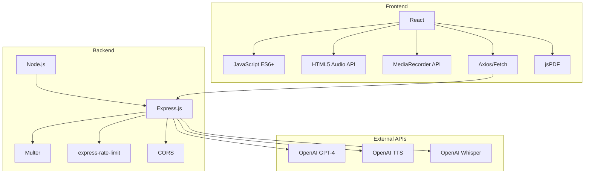

## Request/Response Flow

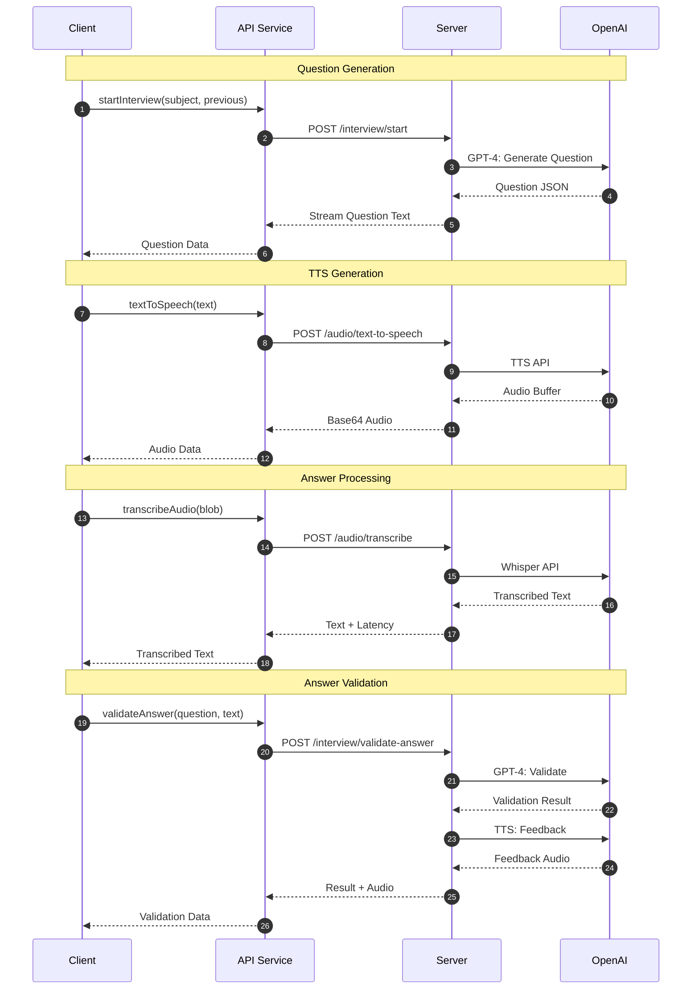

